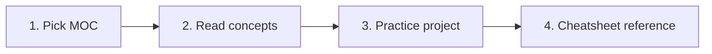

# MOCS

<p align="center">
  
  
  
</p>

<p align="center">
  <i>Maps of Content - structured learning paths connecting concepts, cheatsheets, and projects</i>
</p>

---

## 📑 Table of Contents

- [📌 About](#-about)
- [📁 Content Structure](#-content-structure)
- [🚀 Quick Start](#-quick-start)
- [📂 Categories](#-categories)
- [📖 Usage Guide](#-usage-guide)
- [✅ Best Practices](#-best-practices)
- [🔗 Related Resources](#-related-resources)

---

## 📌 About

**MOCs** (Maps of Content) are curated learning paths for major DevOps and Cloud topics. Each MOC acts as an entry point that connects theory (concepts), practice (projects), and quick reference (cheatsheets) into a coherent study journey.

### Purpose

- Provide a roadmap for each major topic
- Connect concepts + cheatsheets + projects + troubleshooting
- Track learning progress on complex topics
- Avoid getting lost in isolated documents

### Scope

| Included | Not Included |
|----------|--------------|
| Learning paths | Raw theory |
| Topic roadmaps | Quick commands |
| Curated internal links | Debug guides |
| Progress tracking | Project-specific code |

---

## 📁 Content Structure

```
MOCs/
├── MOC-Docker-Production.md          # Container orchestration
├── MOC-Linux-Security.md             # System hardening
├── MOC-Networking-Fundamentals.md    # TCP/IP, OSI, ICMP
├── MOC-Monitoring-Observability.md   # Prometheus, Grafana, Loki
├── MOC-Cloud-AWS.md                  # AWS services
├── MOC-Infrastructure-as-Code.md     # Terraform, Ansible
└── MOCS.md
```

### Organization

| File | Contains |
|------|----------|
| `MOC-Docker-Production.md` | Container lifecycle, Swarm, Compose path |
| `MOC-Linux-Security.md` | SSH, UFW, Fail2ban hardening path |
| `MOC-Networking-Fundamentals.md` | OSI, ICMP, Docker networks path |
| `MOC-Monitoring-Observability.md` | Metrics, logs, alerting path |
| `MOC-Cloud-AWS.md` | EC2, IAM, VPC, S3 path |
| `MOC-Infrastructure-as-Code.md` | Terraform + Ansible workflow path |

---

## 🚀 Quick Start

### Learning Path



### By Level

| Level | Start Here | Goal |
|-------|------------|------|
| Beginner | [[MOC-Linux-Security]] | VPS hardening basics |
| Intermediate | [[MOC-Docker-Production]] | Container orchestration |
| Advanced | [[MOC-Infrastructure-as-Code]] | Full IaC workflow |

---

## 📂 Categories

### 🐳 Docker (1)

**Focus**: Containerization from basics to production

| Document | Description | Status |
|----------|-------------|--------|
| [[MOC-Docker-Production]] | Container lifecycle, Compose, Swarm, Traefik | ✅ |

**Prerequisites**: Basic Linux

---

### 🐧 Linux (1)

**Focus**: System administration and hardening

| Document | Description | Status |
|----------|-------------|--------|
| [[MOC-Linux-Security]] | SSH hardening, UFW, Fail2ban, VPS setup | ✅ |

---

### 🌐 Networking (1)

**Focus**: Network protocols from Layer 3 to Layer 7

| Document | Description | Status |
|----------|-------------|--------|
| [[MOC-Networking-Fundamentals]] | OSI, TCP/IP, ICMP, Docker networking | ✅ |

---

### 📊 Monitoring (1)

**Focus**: Observability stack

| Document | Description | Status |
|----------|-------------|--------|
| [[MOC-Monitoring-Observability]] | Prometheus, Grafana, Loki, ELK | ✅ |

---

### ☁️ Cloud AWS (1)

**Focus**: AWS core services for production workloads

| Document | Description | Status |
|----------|-------------|--------|
| [[MOC-Cloud-AWS]] | EC2, IAM, VPC, S3, RDS, ECS, Lambda | ✅ |

---

### 🏗️ Infrastructure as Code (1)

**Focus**: Automated infrastructure provisioning

| Document | Description | Status |
|----------|-------------|--------|
| [[MOC-Infrastructure-as-Code]] | Terraform workflow + Ansible configuration | ✅ |

---

## 📖 Usage Guide

### Navigation

- **By Topic**: Pick the MOC matching your learning goal
- **By Search**: Use `Ctrl+P` in Obsidian
- **By Links**: Follow `[[wikilinks]]` inside each MOC

### Conventions

| Type | Format | Example |
|------|--------|---------|
| Files | `MOC-Topic-Name.md` | `MOC-Docker-Production.md` |
| Links | `[[MOC-name]]` | `[[MOC-Docker-Production]]` |
| Path | Direct references | To concepts, cheatsheets, projects |

### Status Legend

```
✅ Complete    - Full learning path ready
🚧 In Progress - Being built
📝 Planned     - Scheduled
🔄 Review      - Needs update
```

---

## ✅ Best Practices

### Writing Standards

- **Coherence**: Link all related concepts/cheatsheets/projects
- **Progression**: Order from basics to advanced
- **Checkpoints**: Include self-assessment points
- **Sources**: Reference official documentation

### Contributing

1. Use template from `meta/templates/moc-template.md`
2. Link to existing concepts, cheatsheets, projects
3. Define clear learning checkpoints
4. Add to category table above

### Quality Checklist

```
□ Clear learning objective
□ Logical progression (basics → advanced)
□ Links to concepts/cheatsheets/projects
□ Hands-on milestones included
□ Prerequisites listed
```

---

## 🔗 Related Resources

### Internal

- [[CONCEPTS]] - Deep theory per topic
- [[CHEATSHEETS]] - Quick command reference
- [[PROJECTS]] - Hands-on application
- [[TROUBLESHOOTING]] - Debug when stuck

### External

- [Obsidian LYT Kit](https://publish.obsidian.md/lyt-kit/) - MOC methodology
- [Linking Your Thinking](https://notes.linkingyourthinking.com/) - Nick Milo's approach

---

## 📊 Stats

- **Documents**: 6
- **Categories**: 6
- **Last Updated**: 2025-01-22
- **Completion**: 100%

---

<p align="center">
  Part of <a href="../README.md">DevOps Cloud Vault</a>
</p>
