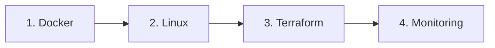

# CHEATSHEETS

<p align="center">
  
  
  
</p>

<p align="center">
  <i>Quick reference guides for DevOps and Cloud tools - commands at your fingertips</i>
</p>

---

## 📑 Table of Contents

- [📌 About](#-about)
- [📁 Content Structure](#-content-structure)
- [🚀 Quick Start](#-quick-start)
- [📂 Categories](#-categories)
- [📖 Usage Guide](#-usage-guide)
- [✅ Best Practices](#-best-practices)
- [🔗 Related Resources](#-related-resources)

---

## 📌 About

**Cheatsheets** contains quick reference guides for essential DevOps and Cloud tools. Each cheatsheet provides command syntax, common patterns, and best practices.

### Purpose

- Instant command lookup without leaving terminal
- Copy-paste ready operations
- Structured format for memorization

### Scope

| Included | Not Included |
|----------|--------------|
| Commands & syntax | Deep theory |
| Common patterns | Full tutorials |
| Quick troubleshooting | Project walkthroughs |

---

## 📁 Content Structure

```
cheatsheets/
├── docker/           # 3 cheatsheets
├── linux/            # 2 cheatsheets
├── prometheus/       # 1 cheatsheet
├── loki/             # 1 cheatsheet
├── ansible/          # 1 cheatsheet
├── terraform/        # 1 cheatsheet
├── aws/              # 1 cheatsheet
├── traefik/          # 1 cheatsheet
├── taskfile/         # 1 cheatsheet
├── github/           # 1 cheatsheet
└── README.md
```

### Organization

| Folder | Contains |
|--------|----------|
| `docker/` | Container, Compose, Swarm commands |
| `linux/` | System admin, security commands |
| `prometheus/` | PromQL queries |
| `loki/` | LogQL queries |
| `terraform/` | IaC commands |

---

## 🚀 Quick Start

### Learning Path



### By Level

| Level | Start Here | Goal |
|-------|------------|------|
| Beginner | [[docker-commands]] | Container basics |
| Intermediate | [[terraform-commands]] | Infrastructure automation |
| Advanced | [[promql-commands]] | Observability |

---

## 📂 Categories

### 🐳 Docker (3)

**Focus**: Container runtime and orchestration

| Document | Description | Status |
|----------|-------------|--------|
| [[docker-commands]] | Container management | ✅ |
| [[docker-compose-commands]] | Multi-container apps | ✅ |
| [[docker-swarm-commands]] | Swarm orchestration | ✅ |

**Prerequisites**: None

---

### 🐧 Linux (2)

**Focus**: System administration

| Document | Description | Status |
|----------|-------------|--------|
| [[linux-basics-commands]] | Essential commands | ✅ |
| [[linux-security-admin-commands]] | Security & hardening | ✅ |

---

### 📊 Monitoring (2)

**Focus**: Observability queries

| Document | Description | Status |
|----------|-------------|--------|
| [[promql-commands]] | Prometheus queries | ✅ |
| [[logql-commands]] | Loki log queries | ✅ |

---

### ☁️ AWS / Terraform / Ansible

**Focus**: Cloud and IaC tools

| Document | Description | Status |
|----------|-------------|--------|
| [[aws-cli]] | AWS operations | ✅ |
| [[terraform-commands]] | IaC commands | ✅ |
| [[ansible-commands]] | Config management | ✅ |

---

### 🔧 Other Tools

**Focus**: Utilities and misc

| Document | Description | Status |
|----------|-------------|--------|
| [[traefik-commands]] | Reverse proxy | ✅ |
| [[taskfile-commands]] | Task runner | ✅ |
| [[github-basics-command]] | Git & GitHub | ✅ |

---

## 📖 Usage Guide

### Navigation

- **By Topic**: Browse category folders
- **By Search**: Use `Ctrl+P` in Obsidian
- **By Links**: Follow `[[wikilinks]]`

### Conventions

| Type | Format | Example |
|------|--------|---------|
| Files | `tool-commands.md` | `docker-commands.md` |
| Folders | `technology/` | `docker/` |
| Links | `[[file-name]]` | `[[docker-commands]]` |

### Status Legend

```
✅ Complete    - Ready to use
🚧 In Progress - Being written
📝 Planned     - Scheduled
```

---

## ✅ Best Practices

### Writing Standards

- **Clarity**: Clear command descriptions
- **Structure**: Organized by operation type (CRUD, debug)
- **Examples**: Real-world use cases
- **Sources**: Link to official docs

### Contributing

1. Use template from `meta/templates/cheatsheet.md`
2. Test all commands before documenting
3. Add to category table above
4. Update stats

### Quality Checklist

```
□ Commands tested
□ Clear descriptions
□ Examples included
□ Official docs linked
```

---

## 🔗 Related Resources

### Internal

- [[concepts]] - Understand the theory
- [[projects]] - Apply in practice
- [[troubleshooting]] - Debug issues

### External

- [Docker Docs](https://docs.docker.com/)
- [Terraform Docs](https://terraform.io/docs/)
- [AWS CLI Reference](https://docs.aws.amazon.com/cli/)

---

## 📊 Stats

- **Documents**: 13
- **Categories**: 10
- **Last Updated**: 2025-01-22
- **Completion**: 100%

---

<p align="center">
  Part of <a href="../README.md">DevOps Cloud Vault</a>
</p>
