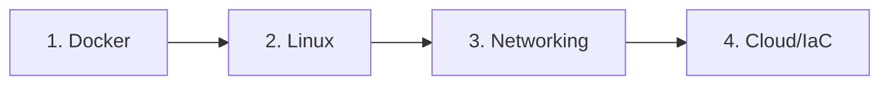

# CONCEPTS

<p align="center">
  
  
  
</p>

<p align="center">
  <i>Deep understanding of DevOps and Cloud technologies - the "why" behind the tools</i>
</p>

---

## 📑 Table of Contents

- [📌 About](#-about)
- [📁 Content Structure](#-content-structure)
- [🚀 Quick Start](#-quick-start)
- [📂 Categories](#-categories)
- [📖 Usage Guide](#-usage-guide)
- [✅ Best Practices](#-best-practices)
- [🔗 Related Resources](#-related-resources)

---

## 📌 About

**Concepts** contains in-depth explanations of fundamental DevOps and Cloud technologies. Focus on theoretical knowledge - understanding how things work internally.

### Purpose

- Deep understanding, not just commands
- Mental models for decision making
- Interview preparation
- Avoid common pitfalls

### Scope

| Included | Not Included |
|----------|--------------|
| How things work | Quick command reference |
| Why to use them | Project-specific context |
| When to apply | Date-stamped learnings |

---

## 📁 Content Structure

```
concepts/
├── docker/           # 11 concepts
├── linux/            # 5 concepts
├── monitoring/       # 5 concepts
├── git/              # 2 concepts
├── networking/       # 1 concept
├── ansible/          # 1 concept
├── terraform/        # 1 concept
├── traefik/          # 1 concept
├── aws/              # 1 concept
└── README.md
```

### Organization

| Folder | Contains |
|--------|----------|
| `docker/` | Containerization, Swarm, Compose |
| `linux/` | Security, SSH, Firewall, Systemd |
| `monitoring/` | Prometheus, Grafana, Loki, ELK |
| `git/` | Fundamentals, Semantic versioning |
| `networking/` | TCP/IP, DNS fundamentals |

---

## 🚀 Quick Start

### Learning Path



### By Level

| Level | Start Here | Goal |
|-------|------------|------|
| Beginner | [[docker-why-containers]] | Understand containerization |
| Intermediate | [[terraform-fundamentals]] | Master IaC |
| Advanced | [[docker-swarm-basics]] | Orchestration |

---

## 📂 Categories

### 🐳 Docker (11)

**Focus**: Containerization fundamentals

| Document | Description | Status |
|----------|-------------|--------|
| [[docker-why-containers]] | Why use containers | ✅ |
| [[docker-containers-lifecycle]] | Container lifecycle | ✅ |
| [[docker-images-layers]] | Image layers | ✅ |
| [[docker-volumes-persistence]] | Data persistence | ✅ |
| [[docker-network-isolation]] | Network isolation | ✅ |
| [[docker-compose-basics]] | Compose fundamentals | ✅ |
| [[docker-compose-healthchecks]] | Healthchecks | ✅ |
| [[docker-swarm-basics]] | Swarm introduction | ✅ |
| [[docker-swarm-overlay-networks]] | Overlay networks | ✅ |
| [[docker-swarm-deployment-strategies]] | Deployment strategies | ✅ |
| [[docker-backup-strategies]] | Backup strategies | ✅ |

**Prerequisites**: Basic Linux

---

### 🐧 Linux (5)

**Focus**: System administration and security

| Document | Description | Status |
|----------|-------------|--------|
| [[linux-basics]] | Linux fundamentals | ✅ |
| [[linux-ssh-hardening]] | SSH security | ✅ |
| [[linux-firewall-ufw]] | UFW firewall | ✅ |
| [[linux-fail2ban]] | Intrusion prevention | ✅ |
| [[linux-systemd-socket]] | Systemd sockets | ✅ |

---

### 📊 Monitoring (5)

**Focus**: Observability stack

| Document | Description | Status |
|----------|-------------|--------|
| [[prometheus-grafana-basics]] | Metrics basics | ✅ |
| [[loki-alloy-basics]] | Log aggregation | ✅ |
| [[golden-signals-slo]] | Golden signals, SLO | ✅ |
| [[alerting-best-practices]] | Alert design | ✅ |
| [[elk-stack-basics]] | ELK stack | ✅ |

---

### 🔀 Git (2)

**Focus**: Version control

| Document | Description | Status |
|----------|-------------|--------|
| [[git-github-fundamentals]] | Git & GitHub basics | ✅ |
| [[git-semantic-versioning]] | SemVer | ✅ |

---

### 🌐 Networking (1)

**Focus**: Network fundamentals

| Document | Description | Status |
|----------|-------------|--------|
| [[networking-fundamentals]] | TCP/IP, DNS, OSI | ✅ |

---

### ☁️ AWS / Terraform / Ansible

**Focus**: Cloud and IaC concepts

| Document | Description | Status |
|----------|-------------|--------|
| [[aws-fundamentals]] | AWS basics | ✅ |
| [[terraform-fundamentals]] | IaC workflow | ✅ |
| [[ansible-fundamentals]] | Configuration mgmt | ✅ |

---

### 🔄 Traefik (1)

**Focus**: Reverse proxy

| Document | Description | Status |
|----------|-------------|--------|
| [[traefik-integration]] | Traefik setup | ✅ |

---

## 📖 Usage Guide

### Navigation

- **By Topic**: Browse category folders
- **By Search**: Use `Ctrl+P` in Obsidian
- **By Links**: Follow `[[wikilinks]]`

### Conventions

| Type | Format | Example |
|------|--------|---------|
| Files | `topic-name.md` | `docker-networks.md` |
| Folders | `technology/` | `docker/` |
| Links | `[[file-name]]` | `[[docker-networks]]` |

### Status Legend

```
✅ Complete    - Ready to use
🚧 In Progress - Being written
📝 Planned     - Scheduled
🔄 Review      - Needs update
```

---

## ✅ Best Practices

### Writing Standards

- **Clarity**: Explain in your own words
- **Structure**: TL;DR, concepts, examples, pitfalls
- **Links**: Cross-reference related concepts
- **Sources**: Cite official documentation

### Contributing

1. Use template from `meta/templates/concept.md`
2. Write in your own words (no copy-paste)
3. Include real examples
4. Add to category table above

### Quality Checklist

```
□ Clear explanation
□ Real examples included
□ Common pitfalls documented
□ Related concepts linked
```

---

## 🔗 Related Resources

### Internal

- [[cheatsheets]] - Quick command reference
- [[projects]] - Apply concepts in practice
- [[troubleshooting]] - Debug with understanding

### External

- [Docker Docs](https://docs.docker.com/)
- [Terraform Docs](https://terraform.io/docs/)
- [AWS Docs](https://docs.aws.amazon.com/)

---

## 📊 Stats

- **Documents**: 28
- **Categories**: 9
- **Last Updated**: 2025-01-22
- **Completion**: 100%

---

<p align="center">
  Part of <a href="../README.md">DevOps Cloud Vault</a>
</p>
