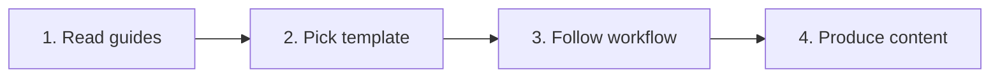

# META

<p align="center">
  
  
  
</p>

<p align="center">
  <i>Templates, guides, and workflows - the tooling behind the vault itself</i>
</p>

---

## 📑 Table of Contents

- [📌 About](#-about)
- [📁 Content Structure](#-content-structure)
- [🚀 Quick Start](#-quick-start)
- [📂 Categories](#-categories)
- [📖 Usage Guide](#-usage-guide)
- [✅ Best Practices](#-best-practices)
- [🔗 Related Resources](#-related-resources)

---

## 📌 About

**Meta** contains everything that supports the vault itself: document templates, usage guides, and learning workflows. It's the "how-to" layer that keeps the rest of the vault consistent and productive.

### Purpose

- Standardize document structure across the vault
- Provide reusable templates for new content
- Document usage workflows (Obsidian, Claude, projects)
- Keep long-term roadmap visible

### Scope

| Included | Not Included |
|----------|--------------|
| Document templates | DevOps theory |
| Usage guides | Project code |
| Learning workflows | Cheatsheets |
| Vault roadmap | Tool documentation |

---

## 📁 Content Structure

```
meta/
├── templates/              # 7 templates
│   ├── concept-template.md
│   ├── cheatsheet-template.md
│   ├── moc-template.md
│   ├── project-template.md
│   ├── troubleshooting-template.md
│   ├── readme-project-template.md
│   └── readme-vault-template.md
├── guides/                 # 3 guides
│   ├── claude-guide.md
│   ├── obsidian-guide.md
│   └── templates-usage-guide.md
├── workflows/              # 2 workflows
│   ├── obsidian-workflow.md
│   └── project-workflow.md
├── roadmap.md              # Long-term vault roadmap
└── META.md
```

### Organization

| Folder | Contains |
|--------|----------|
| `templates/` | Reusable document skeletons |
| `guides/` | How-to references (Obsidian, Claude, templates) |
| `workflows/` | Step-by-step processes for recurring tasks |

---

## 🚀 Quick Start

### Learning Path



### By Need

| Need | Start Here | Goal |
|------|------------|------|
| New concept doc | [[concept-template]] | Write consistent theory |
| New project report | [[project-template]] | Structured learnings |
| Setup Obsidian | [[obsidian-guide]] | Master the vault tool |
| Use Claude effectively | [[claude-guide]] | Better AI assistance |

---

## 📂 Categories

### 📝 Templates (7)

**Focus**: Reusable document skeletons

| Document | Description | Status |
|----------|-------------|--------|
| [[concept-template]] | Theory & deep-dive documents | ✅ |
| [[cheatsheet-template]] | Quick command reference | ✅ |
| [[moc-template]] | Map of Content structure | ✅ |
| [[project-template]] | Project learning report | ✅ |
| [[troubleshooting-template]] | Debug guide format | ✅ |
| [[readme-project-template]] | Project repo README | ✅ |
| [[readme-vault-template]] | Vault section README | ✅ |

---

### 📖 Guides (3)

**Focus**: How-to references

| Document | Description | Status |
|----------|-------------|--------|
| [[claude-guide]] | Using Claude with the vault | ✅ |
| [[obsidian-guide]] | Obsidian setup & usage | ✅ |
| [[templates-usage-guide]] | How to apply templates | ✅ |

---

### 🔄 Workflows (2)

**Focus**: Repeatable processes

| Document | Description | Status |
|----------|-------------|--------|
| [[obsidian-workflow]] | Daily Obsidian routine | ✅ |
| [[project-workflow]] | Project lifecycle (start → learning report) | ✅ |

---

### 🗺️ Roadmap (1)

**Focus**: Long-term vault evolution

| Document | Description | Status |
|----------|-------------|--------|
| [[roadmap]] | Planned sections, topics, priorities | ✅ |

---

## 📖 Usage Guide

### Navigation

- **By Need**: Check the "Quick Start" table above
- **By Type**: Browse `templates/`, `guides/`, `workflows/`
- **By Search**: Use `Ctrl+P` in Obsidian

### Conventions

| Type | Format | Example |
|------|--------|---------|
| Templates | `<type>-template.md` | `concept-template.md` |
| Guides | `<tool>-guide.md` | `obsidian-guide.md` |
| Workflows | `<domain>-workflow.md` | `project-workflow.md` |
| Links | `[[file-name]]` | `[[concept-template]]` |

### Status Legend

```
✅ Complete    - Ready to use
🚧 In Progress - Being written
📝 Planned     - Scheduled
🔄 Review      - Needs update
```

---

## ✅ Best Practices

### Writing Standards

- **Reusability**: Templates should fit multiple use cases
- **Clarity**: Guides must be actionable step-by-step
- **Versioning**: Update templates as vault evolves
- **Consistency**: Cross-reference related meta docs

### Contributing

1. New template → follow existing naming `<type>-template.md`
2. Test the template on a real document before committing
3. Update `templates-usage-guide.md` if needed
4. Add to category table above

### Quality Checklist

```
□ Template tested on real content
□ Guide includes concrete examples
□ Workflow has clear entry/exit points
□ Cross-references to related docs
□ Updated in this index
```

---

## 🔗 Related Resources

### Internal

- [[concepts]] - Where concept-template is applied
- [[cheatsheets]] - Where cheatsheet-template is applied
- [[projects]] - Where project-template is applied
- [[troubleshooting]] - Where troubleshooting-template is applied
- [[MOCS]] - Where moc-template is applied

### External

- [Obsidian Help](https://help.obsidian.md/)
- [LYT Kit (MOC methodology)](https://publish.obsidian.md/lyt-kit/)
- [Anthropic Docs](https://docs.anthropic.com/)

---

## 📊 Stats

- **Documents**: 11
- **Categories**: 4 (Templates, Guides, Workflows, Roadmap)
- **Last Updated**: 2025-01-22
- **Completion**: 100%

---

<p align="center">
  Part of <a href="../README.md">DevOps Cloud Vault</a>
</p>
