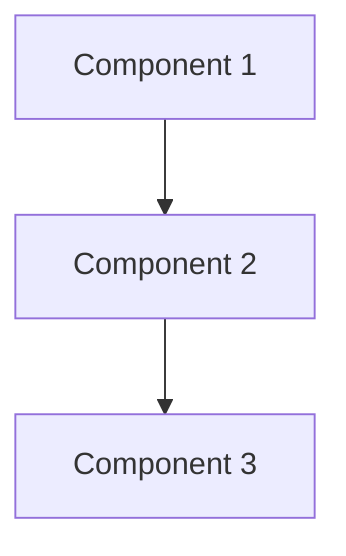

# [PROJECT NAME]

<p align="center">
  
  
  
</p>

<p align="center">
  <i>[One-line description of what the project does]</i>
</p>

---

## 📑 Table of Contents

<!-- Keep only relevant sections for your project -->

- [📌 About](#-about)
- [🏗️ Architecture](#️-architecture) *(optional)*
- [⚠️ Constraints & Limitations](#️-constraints--limitations) *(optional)*
- [📁 Project Structure](#-project-structure)
- [✅ Prerequisites](#-prerequisites)
- [🚀 Quick Start](#-quick-start)
- [⚙️ Configuration](#️-configuration) *(optional)*
- [📖 Usage](#-usage)
- [🧪 Testing](#-testing) *(optional)*
- [🔧 Troubleshooting](#-troubleshooting) *(optional)*

---

## 📌 About

[2-3 sentences describing what this project does and why it exists.]

### Tech Stack

| Component | Technology |
|-----------|------------|
| [Component] | [Technology] |
| [Component] | [Technology] |

### Features

- [Feature 1]
- [Feature 2]
- [Feature 3]

---

## 🏗️ Architecture

> **Note**: Include this section for multi-component projects, infrastructure, or when visual representation helps understanding. Delete for simple projects.

### Overview

<!-- Choose the appropriate format: Mermaid, ASCII, or link to diagram image -->



<!-- Alternative: ASCII diagram -->
```
[Component 1] ──► [Component 2] ──► [Component 3]
```

<!-- Alternative: External diagram -->
<!--  -->

---

## ⚠️ Constraints & Limitations

> **Note**: Include this section when working with resource limits, free tiers, or specific constraints. Delete if not applicable.

### Current Limitations

| Constraint | Impact |
|------------|--------|
| [Constraint 1] | [Impact] |
| [Constraint 2] | [Impact] |

### Ideal Setup (if applicable)

For production/unlimited resources:

| Component | Current | Ideal |
|-----------|---------|-------|
| [Component] | [Current] | [Ideal] |

---

## 📁 Project Structure

```
[project-name]/
├── [folder/]
│   ├── [file]              # [Description]
│   └── [file]              # [Description]
├── [file]                  # [Description]
└── README.md
```

---

## ✅ Prerequisites

### Required

| Requirement | Version | Notes |
|-------------|---------|-------|
| [Tool/Language] | >= X.X | [Installation link or command] |

### Setup

```bash
# [Setup commands if needed]
[command]
```

---

## 🚀 Quick Start

### TL;DR

```bash
[single command or minimal steps to run the project]
```

### Step by Step

```bash
# 1. Clone
git clone [repo-url]
cd [project-name]

# 2. Install/Build
[install or build command]

# 3. Run
[run command]
```

### Verify

```bash
# Expected output or verification command
[command]
```

---

## ⚙️ Configuration

> **Note**: Include this section if your project has configurable options. Delete for simple projects.

### Environment Variables

| Variable | Default | Description |
|----------|---------|-------------|
| `[VAR_NAME]` | `[default]` | [Description] |

### Configuration File

File: `[path/to/config]`

```[language]
# Example configuration
[example]
```

---

## 📖 Usage

### Basic Usage

```bash
[basic usage command or code example]
```

### Examples

```bash
# Example 1: [Description]
[command]

# Example 2: [Description]
[command]
```

### API/Interface (if applicable)

| Endpoint/Function | Description |
|-------------------|-------------|
| `[endpoint]` | [Description] |

---

## 🧪 Testing

> **Note**: Include this section if your project has tests. Delete otherwise.

```bash
# Run tests
[test command]

# Run specific test
[specific test command]
```

---

## 🔧 Troubleshooting

> **Note**: Include this section for common issues. Delete if not needed.

### Common Issues

<details>
<summary><strong>[Issue 1]</strong></summary>

**Symptom**: [What happens]

**Solution**:
```bash
[fix command]
```
</details>

<details>
<summary><strong>[Issue 2]</strong></summary>

**Symptom**: [What happens]

**Solution**: [Steps to fix]
</details>

### Debug

```bash
# Useful debug commands
[command]
```

---

**Last Updated**: YYYY-MM-DD
**Version**: X.X
**License**: [License]
