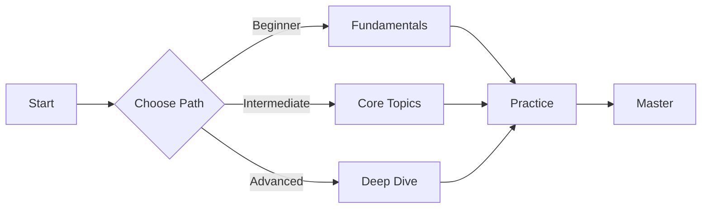

# [SECTION NAME]

<p align="center">
  
  
  
</p>

<p align="center">
  <i>[Brief description of this section's purpose]</i>
</p>

<p align="center">
  aliases: [section-name]
</p>

---

## Table of Contents
- [About](#about)
- [Content Structure](#content-structure)
- [Quick Start](#quick-start)
- [Categories](#categories)
- [Usage Guide](#usage-guide)
- [Best Practices](#best-practices)
- [Related Resources](#related-resources)
- [Contributing](#contributing)

## About

**[Section Name]** contains [description of what this section holds and its purpose in the repository].

### Why This Section?

This section helps with:
- **[Benefit 1]**: [Description]
- **[Benefit 2]**: [Description]
- **[Benefit 3]**: [Description]

**Use Cases:**
- [Use case 1]
- [Use case 2]
- [Use case 3]

## Content Structure

```
[folder-name]/
├── [category-1]/
│   ├── file1.md           # [Description]
│   ├── file2.md           # [Description]
│   └── README.md
├── [category-2]/
│   ├── file1.md
│   └── README.md
└── README.md              # This file
```

### Content Organization

- **[Category 1]**: [What it contains]
- **[Category 2]**: [What it contains]
- **[Category 3]**: [What it contains]

## Quick Start

### For Beginners

```bash
# Start with these fundamental resources
1. [Resource 1] - [Why important]
2. [Resource 2] - [Why important]
3. [Resource 3] - [Why important]
```

### For Intermediate Users

```bash
# Explore these advanced topics
1. [Topic 1]
2. [Topic 2]
3. [Topic 3]
```

### For Advanced Users

```bash
# Deep dive into
1. [Advanced topic 1]
2. [Advanced topic 2]
```

## Categories

### 🔧 [Category 1 Name]
**Focus**: [What this category covers]

**Available Resources**:
- [[resource-1]] - [Short description]
- [[resource-2]] - [Short description]
- [[resource-3]] - [Short description]

**Learning Path**:
1. Start with [resource]
2. Then move to [resource]
3. Finally master [resource]

---

### 🐳 [Category 2 Name]
**Focus**: [What this category covers]

**Available Resources**:
- [[resource-1]] - [Short description]
- [[resource-2]] - [Short description]

**Prerequisites**: [[prerequisite-concept]]

---

### ☁️ [Category 3 Name]
**Focus**: [What this category covers]

**Available Resources**:
- [[resource-1]] - [Short description]

**Related**: [[related-concept]]

---

## Usage Guide

### How to Navigate

1. **By Technology**: Browse [category] for specific tech stack
2. **By Topic**: Use [category] for conceptual understanding
3. **By Use Case**: Check [category] for practical examples

### Naming Conventions

- **Files**: `lowercase-with-dashes.md`
- **Concepts**: `concept-name.md`
- **Cheatsheets**: `tool-name.md`
- **Projects**: `project-description.md`

### Templates

Each document type follows a specific template:
- **[Type 1]**: See [meta/templates/template1.md](../meta/templates/template1.md)
- **[Type 2]**: See [meta/templates/template2.md](../meta/templates/template2.md)

## Best Practices

### 📖 Reading Guide

- **Quick Reference**: Jump directly to specific [sections]
- **Deep Learning**: Follow the learning path in each category
- **Hands-On**: Try examples in [[projects]]
- **Troubleshooting**: Check [[troubleshooting]] for common issues

### ✍️ Contributing

When adding new content:
1. Use the appropriate template from [meta/templates/](../meta/templates/)
2. Follow the naming conventions
3. Include metadata section
4. Add cross-references to related content
5. Update this README with links

### 🎯 Learning Strategy

**Recommended Approach**:
```
1. Read concept → 2. Review cheatsheet → 3. Build project → 4. Troubleshoot
```

**Time Investment**:
- Concepts: 1-2h per topic
- Cheatsheets: 30min quick reference
- Projects: 2-4h hands-on
- Review: 30min retention check

## Related Resources

### Internal Links
- [[meta/templates]] - Document templates
- [[meta/guides]] - Usage guides
- [[concepts]] - Conceptual foundations
- [[cheatsheets]] - Quick references

### External Resources
- [Official Docs](URL) - Primary documentation
- [Community Resources](URL) - Additional learning materials
- [Video Tutorials](URL) - Visual learning

### Learning Path



## Statistics

- **Total Documents**: [Number]
- **Categories**: [Number]
- **Last Updated**: YYYY-MM-DD
- **Completion**: [X]%

## Status Indicators

```
✅ Complete - Fully documented and tested
🚧 In Progress - Work in progress
📝 Planned - Scheduled for creation
🔄 Review - Needs update/revision
```

**Current Status**: [Status]

## Contributing

Contributions are welcome! To add or improve content:

```bash
# Follow the template structure
1. Choose appropriate template from meta/templates/
2. Create your content
3. Update this README
4. Cross-reference related documents
```

### Quality Standards

- **Clarity**: Explain concepts clearly with examples
- **Accuracy**: Verify all technical information
- **Completeness**: Include prerequisites, examples, and troubleshooting
- **Consistency**: Follow established templates and conventions

## Contact & Support

- **Issues**: Report in [[troubleshooting]]
- **Questions**: Check [[concepts]] first
- **Improvements**: Follow contributing guidelines

---

<p align="center">
  <b>⭐ Keep learning and building!</b>
</p>

<p align="center">
  Part of the <a href="../README.md">[Project Name]</a> knowledge base
</p>

---

**Last Updated**: YYYY-MM-DD
**Version**: 1.0
**Maintained by**: [Your Name]
