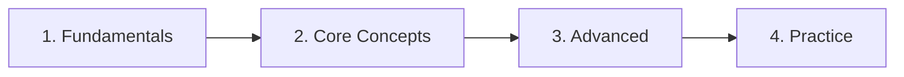

# [SECTION NAME]

<p align="center">
  
  
  
</p>

<p align="center">
  <i>[Brief description of this section's purpose]</i>
</p>

---

## 📑 Table of Contents

- [📌 About](#-about)
- [📁 Content Structure](#-content-structure)
- [🚀 Quick Start](#-quick-start)
- [📂 Categories](#-categories)
- [📖 Usage Guide](#-usage-guide)
- [✅ Best Practices](#-best-practices)
- [🔗 Related Resources](#-related-resources)

---

## 📌 About

**[Section Name]** contains [description of what this section holds and its purpose].

### Purpose

- [Purpose 1]
- [Purpose 2]
- [Purpose 3]

### Scope

| Included | Not Included |
|----------|--------------|
| [Topic] | [Topic] |
| [Topic] | [Topic] |

---

## 📁 Content Structure

```
[section-name]/
├── [category-1]/
│   ├── [topic].md
│   └── README.md
├── [category-2]/
│   ├── [topic].md
│   └── README.md
└── README.md
```

### Organization

| Folder | Contains |
|--------|----------|
| `[category-1]/` | [Description] |
| `[category-2]/` | [Description] |

---

## 🚀 Quick Start

### Learning Path



### By Level

| Level | Start Here | Goal |
|-------|------------|------|
| Beginner | [[topic-1]] | [Goal] |
| Intermediate | [[topic-2]] | [Goal] |
| Advanced | [[topic-3]] | [Goal] |

---

## 📂 Categories

### 🔧 [Category 1]

**Focus**: [What this category covers]

| Document | Description | Status |
|----------|-------------|--------|
| [[doc-1]] | [Description] | ✅ |
| [[doc-2]] | [Description] | 🚧 |

**Prerequisites**: [None or [[prerequisite]]]

---

### 📦 [Category 2]

**Focus**: [What this category covers]

| Document | Description | Status |
|----------|-------------|--------|
| [[doc-1]] | [Description] | ✅ |

**Related**: [[related-section]]

---

## 📖 Usage Guide

### Navigation

- **By Topic**: Browse category folders
- **By Search**: Use `Ctrl+P` in Obsidian
- **By Links**: Follow `[[wikilinks]]`

### Conventions

| Type | Format | Example |
|------|--------|---------|
| Files | `lowercase-dashes.md` | `docker-basics.md` |
| Folders | `lowercase-dashes/` | `container-orchestration/` |
| Links | `[[file-name]]` | `[[docker-basics]]` |

### Status Legend

```
✅ Complete    - Ready to use
🚧 In Progress - Being written
📝 Planned     - Scheduled
🔄 Review      - Needs update
```

---

## ✅ Best Practices

### Writing Standards

- **Clarity**: Explain concepts simply, add examples
- **Structure**: Use headers, lists, tables for readability
- **Links**: Cross-reference related documents with `[[wikilinks]]`
- **Sources**: Cite official docs, avoid outdated content

### Contributing

1. Use templates from `meta/templates/`
2. Follow naming conventions
3. Add document to category table
4. Update stats if needed

### Quality Checklist

```
□ Clear title and purpose
□ Correct category placement
□ Prerequisites listed
□ Examples included
□ Related links added
□ Status indicator set
```

---

## 🔗 Related Resources

### Internal

- [[related-section-1]]
- [[related-section-2]]

### External

- [Official Documentation](URL)
- [Community Resources](URL)

---

## 📊 Stats

- **Documents**: [N]
- **Categories**: [N]
- **Last Updated**: YYYY-MM-DD
- **Completion**: [X]%

---

<p align="center">
  Part of <a href="../README.md">[Vault Name]</a>
</p>
