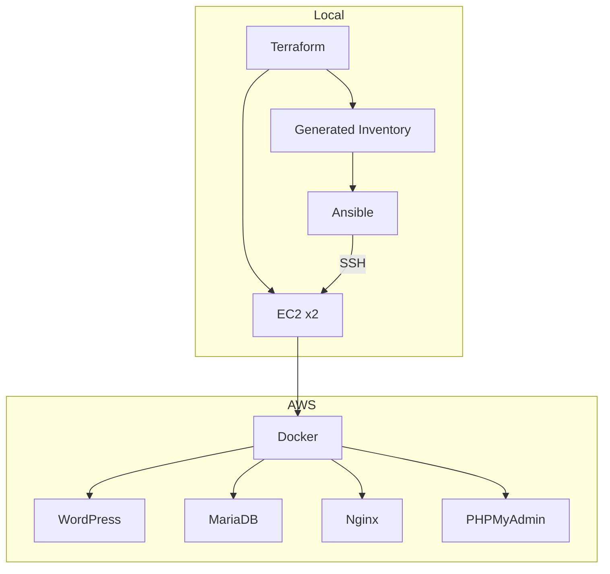

# AWS-Terraform-Ansible - Learning Report

## 📋 Metadata

```yaml
tags: [project, aws, terraform, ansible, docker, 2025-01]
duration: 40h
status: completed
```

**Technologies**: AWS EC2, Terraform, Ansible, Docker, Docker Compose, Nginx, WordPress, MariaDB
**Goal**: Automatically deploy a WordPress infrastructure on AWS via IaC
**Repo**: [github.com/username/AWS-Terraform-Ansible](https://github.com/username/AWS-Terraform-Ansible)

---

## 🎯 Project Context

### Objective
First Infrastructure as Code project: provision EC2 instances on AWS with Terraform, then automatically configure servers with Ansible to deploy containerized WordPress.

### Architecture



### Tech Stack
- **Infrastructure**: Terraform (AWS provider)
- **Configuration**: Ansible + community.docker
- **Containers**: Docker, Docker Compose v2
- **Cloud**: AWS EC2, Security Groups, IAM roles
- **Application**: WordPress, MariaDB, Nginx, PHPMyAdmin, WP-CLI

---

## 📚 What I Learned

### 1. Terraform Workflow
- **Difficulty**: 3/5
- **Time**: 15h
- **Key insight**: The tfstate is the "land registry" of the infrastructure. Without it, Terraform doesn't know what exists. The init→plan→apply workflow is critical to understand.
- **Extracted to**: [[concepts/terraform/terraform-fundamentals]]

### 2. Ansible Idempotence
- **Difficulty**: 3/5
- **Time**: 12h
- **Key insight**: Running a playbook N times = same result. Ansible modules guarantee idempotence, unlike raw shell commands.
- **Extracted to**: [[concepts/ansible/ansible-fundamentals]]

### 3. AWS Security Groups
- **Difficulty**: 2/5
- **Time**: 5h
- **Key insight**: SG = instance-level firewall. Deny by default in both directions (ingress AND egress). Forgetting egress = no Internet access from instance.
- **Extracted to**: [[concepts/aws/aws-fundamentals]]

---

## ⚠️ Challenges & Solutions

### Challenge 1: EC2 created but SSH not ready

**Problem**: Ansible failed immediately after `terraform apply` because the EC2 wasn't yet accessible via SSH.

**Root Cause**: EC2 "running" != SSH ready. The SSH service takes a few seconds to start after boot.

**Solution**:
```hcl
# SSH wait loop before launching Ansible
resource "null_resource" "wait_ssh" {
  depends_on = [aws_instance.wordpress_server]

  provisioner "local-exec" {
    command = <<-EOT
      until ssh -o ConnectTimeout=2 -o StrictHostKeyChecking=no \
        ubuntu@${aws_instance.wordpress_server.public_ip} exit 2>/dev/null; do
        sleep 5
      done
    EOT
  }
}

resource "null_resource" "run_ansible" {
  depends_on = [null_resource.wait_ssh]
  # ...
}
```

**Time wasted**: 1h30
**Lesson**: Always wait for SSH to be actually ready before triggering dependent actions.

---

### Challenge 2: Different Docker versions (test VPS vs EC2)

**Problem**: The Ansible playbook worked on my test VPS but failed on EC2 with Docker module errors.

**Root Cause**: I had tested on multiple VPS with different Ubuntu/Docker versions. The `community.docker` modules weren't compatible the same way.

**Solution**:
```yaml
# Check Docker version before using modules
- name: Check Docker version
  command: docker --version
  register: docker_check
  ignore_errors: yes
  changed_when: false

# Use docker_compose_v2 (more stable)
- name: Deploy with compose
  community.docker.docker_compose_v2:
    project_src: "{{ app_directory }}"
    state: present
```

**Time wasted**: 1h30
**Lesson**: Always test on an environment IDENTICAL to the target. Personal VPS != fresh EC2 Ubuntu.

---

### Challenge 3: WordPress no Internet access for WP-CLI

**Problem**: `wp core install` failed because WordPress couldn't download resources.

**Root Cause**: The WordPress container didn't have Internet access (Docker network or egress SG issue).

**Solution**:
```yaml
# Ensure SG allows outbound traffic
egress {
  from_port   = 0
  to_port     = 0
  protocol    = "-1"
  cidr_blocks = ["0.0.0.0/0"]
}

# And verify Docker network
- name: Wait for WordPress to be reachable
  uri:
    url: "http://{{ ansible_host }}:{{ nginx_port }}"
    status_code: [200, 302]
  register: _result
  until: _result.status in [200, 302]
  retries: 30
  delay: 5
```

**Time wasted**: 2h
**Lesson**: Always check egress SG + Docker network when a container has no Internet.

---

## 🔧 Reusable Assets

**Configs**:
- `terraform/main.tf` - EC2 + SG + Ansible trigger template
- `ansible/playbooks/01-docker-installation.yml` - Idempotent Docker installation
- `ansible/playbooks/02-deploy-wordpress.yml` - Complete WordPress deployment

**Commands discovered**:
```bash
# Wait for SSH ready
until ssh -o ConnectTimeout=2 user@host exit 2>/dev/null; do sleep 5; done

# List EC2 instances with IPs
aws ec2 describe-instances \
  --query "Reservations[*].Instances[*].[InstanceId,PublicIpAddress]" \
  --output table
```

**Updated**: [[cheatsheets/terraform/terraform-commands]], [[cheatsheets/ansible/ansible-commands]], [[cheatsheets/aws/aws-cli]]

---

## ⏱️ Time Breakdown

| Phase | Assisted | Autonomous | Total |
|-------|----------|------------|-------|
| Learning concepts | 10h | 5h | 15h |
| Implementation | 5h | 10h | 15h |
| Debugging | 3h | 5h | 8h |
| Documentation | 2h | 0h | 2h |
| **TOTAL** | **20h (50%)** | **20h (50%)** | **40h** |

**Tech distribution**:
- Terraform: 15h
- Ansible: 15h
- AWS/Docker: 10h

---

## 📊 Outcomes

### Success Metrics
- Infrastructure deployed automatically in ~5 minutes
- WordPress accessible with PHPMyAdmin
- Reproducible (destroy + apply = same result)

### What Worked Well
1. **Terraform + Ansible combo**: Clear separation between provisioning and configuration
2. **Auto-generated inventory**: Terraform generates Ansible inventory, no manual sync

### What Could Be Improved
1. **Test on identical environment**: Avoid testing on a different VPS than the target
2. **Sensitive variables**: Use Ansible Vault for passwords instead of plaintext group_vars
3. **Remote state**: Configure S3 backend for tfstate from the start

---

## ✅ Extractions TODO

- [x] Extract [[concepts/terraform/terraform-fundamentals]]
- [x] Extract [[concepts/ansible/ansible-fundamentals]]
- [x] Extract [[concepts/aws/aws-fundamentals]]
- [x] Update [[cheatsheets/terraform/terraform-commands]]
- [x] Update [[cheatsheets/ansible/ansible-commands]]
- [x] Update [[cheatsheets/aws/aws-cli]]

---

**Completed**: 2025-01-21
**Last updated**: 2025-01-21
