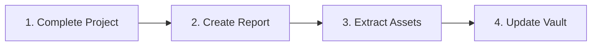

# PROJECTS

<p align="center">
  
  
  
</p>

<p align="center">
  <i>Learning reports from real DevOps and Cloud projects - extracting knowledge from hands-on experience</i>
</p>

---

## 📑 Table of Contents

- [📌 About](#-about)
- [📁 Content Structure](#-content-structure)
- [🚀 Quick Start](#-quick-start)
- [📂 Categories](#-categories)
- [📖 Usage Guide](#-usage-guide)
- [✅ Best Practices](#-best-practices)
- [🔗 Related Resources](#-related-resources)

---

## 📌 About

**Projects** contains post-mortem learning reports from real DevOps and Cloud projects. This folder captures what you learned, challenges faced, and knowledge extracted from actual project work.

### Purpose

- Extract learnings from real project experience
- Track progress and growth over time
- Build knowledge base from hands-on work
- Portfolio documentation with concrete examples

### Scope

| Included | Not Included |
|----------|--------------|
| Learning reports | Project code |
| Challenges & solutions | Full tutorials |
| Time tracking | Configuration files |

### Where's The Code?

**Important**: This folder does NOT contain project code. Real project code lives in:
- Separate Git repositories
- Client repositories (if professional work)

This folder only contains:
- ✅ Learning reports (what you learned)
- ✅ Challenges encountered and solutions
- ✅ Links to reusable assets in `devops-cloud_tools/`

---

## 📁 Content Structure

```
projects/
├── 2024-11-ft-ping-traceroute/
│   └── learnings.md
├── 2024-XX-transcendence-monitoring/
│   └── learnings.md
├── 2025-01-aws-terraform-ansible/
│   └── learnings.md
├── 2025-12-glasck-deployment/
│   └── learnings.md
├── 2025-12-vps-hetzner-init-setup/
│   └── learnings.md
└── README.md
```

### Organization

| Folder | Contains |
|--------|----------|
| `YYYY-MM-name/` | Project learning report |
| `learnings.md` | Main document per project |

### Naming Convention

Format: `YYYY-MM-descriptive-name/`

---

## 🚀 Quick Start

### Learning Path



### After Completing a Project

```bash
# 1. Create project folder
mkdir projects/YYYY-MM-project-name/

# 2. Copy template
cp meta/templates/project.md projects/YYYY-MM-project-name/learnings.md

# 3. Fill in learnings
# 4. Extract reusable scripts to devops-cloud_tools/
# 5. Update concepts/cheatsheets/troubleshooting
```

### By Level

| Level | Start Here | Goal |
|-------|------------|------|
| Beginner | [[2025-12-vps-hetzner-init-setup]] | Linux security |
| Intermediate | [[2025-01-aws-terraform-ansible]] | IaC basics |
| Advanced | [[2025-12-glasck-deployment]] | Production Docker |

---

## 📂 Categories

### 🐳 Docker (1)

**Focus**: Container-based deployments

| Document | Description | Duration | Status |
|----------|-------------|----------|--------|
| [[2025-12-glasck-deployment]] | Docker Compose, Traefik v3, Production | ~40h | ✅ |

---

### ☁️ AWS / Terraform (1)

**Focus**: Cloud infrastructure

| Document | Description | Duration | Status |
|----------|-------------|----------|--------|
| [[2025-01-aws-terraform-ansible]] | AWS EC2, Terraform, Ansible, WordPress | ~40h | ✅ |

---

### 📊 Monitoring (1)

**Focus**: Observability stack

| Document | Description | Duration | Status |
|----------|-------------|----------|--------|
| [[2024-XX-transcendence-monitoring]] | ELK Stack, Prometheus, Grafana | ~25h | ✅ |

---

### 🌐 Networking (1)

**Focus**: Network fundamentals

| Document | Description | Duration | Status |
|----------|-------------|----------|--------|
| [[2024-11-ft-ping-traceroute]] | C, Raw Sockets, ICMP Protocol | ~90h | ✅ |

---

### 🐧 Linux (1)

**Focus**: System administration

| Document | Description | Duration | Status |
|----------|-------------|----------|--------|
| [[2025-12-vps-hetzner-init-setup]] | VPS hardening, UFW, Fail2Ban, SSH | ~2h30 | ✅ |

---

## 📖 Usage Guide

### Navigation

- **By Date**: Projects sorted chronologically
- **By Technology**: Browse by category
- **By Search**: Use `Ctrl+P` in Obsidian

### Conventions

| Type | Format | Example |
|------|--------|---------|
| Folders | `YYYY-MM-name/` | `2025-01-aws-terraform-ansible/` |
| Files | `learnings.md` | Main document |
| Links | `[[folder-name]]` | `[[2025-01-aws-terraform-ansible]]` |

### Report Structure

Each `learnings.md` includes:
- **Project Context**: Problem solved
- **What I Learned**: New skills acquired
- **Challenges**: Problems encountered
- **Solutions**: How you fixed them
- **Reusable Assets**: Scripts extracted

### Status Legend

```
✅ Documented - Learning report completed
🚧 In Progress - Project ongoing
📝 Planned    - Future project scheduled
🔄 Review     - Needs retention check
```

---

## ✅ Best Practices

### Writing Standards

- **Be Honest**: Document failures, not just successes
- **Be Specific**: Include exact commands and errors
- **Track Time**: Record time invested for efficiency
- **Extract Knowledge**: Update concepts/cheatsheets/troubleshooting

### Contributing

1. Use template from `meta/templates/project.md`
2. Follow naming convention `YYYY-MM-name/`
3. Document challenges and solutions
4. Extract reusable assets
5. Update category table above

### Knowledge Extraction Checklist

After each project, update:

```
□ Projects: Create learnings.md
□ Concepts: Add real examples
□ Cheatsheets: Add useful commands
□ Troubleshooting: Document errors solved
□ devops-cloud_tools: Extract scripts
```

### Quality Checklist

```
□ Project context clear
□ Learnings documented
□ Challenges and solutions included
□ Reusable assets extracted
□ Knowledge base updated
```

---

## 🔗 Related Resources

### Internal

- [[concepts]] - Add real examples from projects
- [[cheatsheets]] - Add commands discovered
- [[troubleshooting]] - Document errors solved
- [[meta/templates/project]] - Template for new projects

### External

- Your actual project repositories
- Claude Projects (if using AI assistance)

---

## 📊 Stats

- **Documents**: 5
- **Categories**: 5
- **Last Updated**: 2025-01-22
- **Completion**: 100%

---

<p align="center">
  Part of <a href="../README.md">DevOps Cloud Vault</a>
</p>
